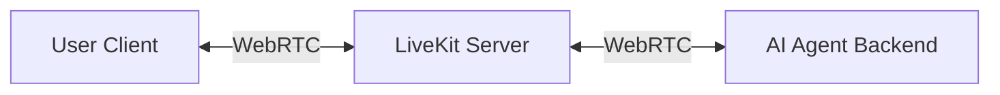

# High-Level Architecture with LiveKit

## System Overview

The system relies on **LiveKit** as the central real-time infrastructure, facilitating low-latency transmission of audio, video, and screen data between the User (Client) and the AI (Server Agent).

## Core Components

### 1. User Client (Frontend)
- **Role:** The point of interaction for the user.
- **Functions:**
  - **Connects:** Joins a LiveKit "Room" using an access token.
  - **Publishes:** Sends User Audio (Mic), User Video (Webcam), and Screen Share tracks to the LiveKit Server.
  - **Subscribes:** Listens for the AI Agent's audio and viewing status.

### 2. LiveKit Server (The Bridge)
- **Role:** The Selective Forwarding Unit (SFU) and signaling server.
- **Functions:**
  - **Routing:** Instantly routes media tracks between the Client and the Agent.
  - **Room Management:** Maintains the session state and participant list.
  - **Low Latency:** Ensures "conversational" speed (sub-second delay).

### 3. AI Agent (Backend)
- **Role:** A headless participant that "lives" on the server.
- **Functions:**
  - **Listening (STT):** Subscribes to user audio and converts it to text (Speech-to-Text).
  - **Vision (OCR/Analysis):** Subscribes to user's video/screen tracks. It samples frames to "see" what the user is doing.
  - **Thinking (LLM):** Processes text and visual context to generate a response.
  - **Speaking (TTS):** Converts text response to audio and *publishes* it back to the room as an audio track.

## Data Flow Workflow

1.  **Input:** User speaks or shares screen.
2.  **Transport:** Client pushes execution media tracks to **LiveKit Server**.
3.  **Reception:** **LiveKit** forwards these tracks to the **AI Agent**.
4.  **Processing:**
    *   **Agent** converts Audio -> Text.
    *   **Agent** captures Screen Frame -> Vision Model.
    *   **Agent** generates reasoned response.
5.  **Output:** **Agent** streams synthesized audio back to **LiveKit**.
6.  **Playback:** **LiveKit** delivers audio to **User Client** for playback.
